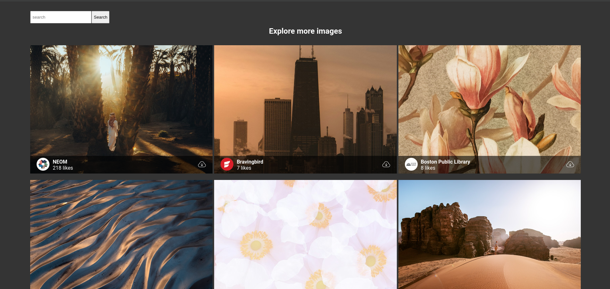

# React + TypeScript + Vite + Scss + [Unsplash](https://unsplash.com/)

## Here you can
* ### explore 
* ### search (not yet)
* ### safe (not yet)
* ### download (not yet)

## - Images

---
# To run project locally

* #### create `.env` file in root directory and create variable `VITE_ACCESS_KEY` then paste your access key from unsplash
* #### `npm i`
* #### `npm run dev`

---
# To build project

* #### `npm run build`